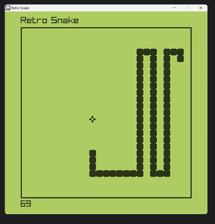

# C++ Snake game using Raylib.

This GitHub repository contains the full source code for a Snake game created using the raylib game development library. The game is programmed in the C++ programming language and uses various raylib functions for graphics, input handling, and audio. The game is designed to be played on desktop computers running Windows, macOS, or Linux operating systems.

